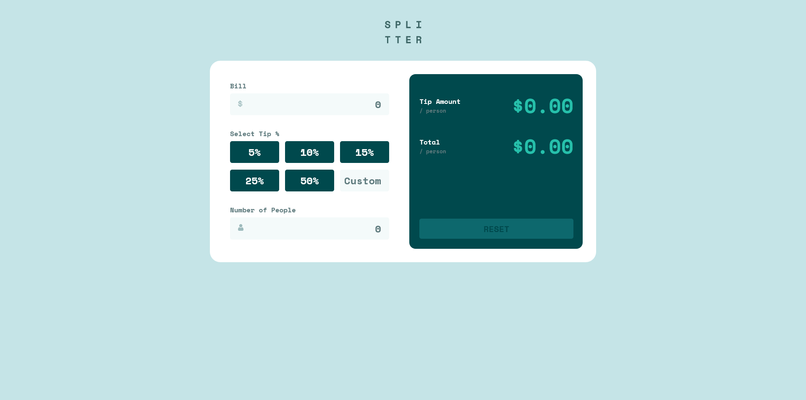

# Frontend Mentor - Tip calculator app solution

This is a solution to the [Tip calculator app challenge on Frontend Mentor](https://www.frontendmentor.io/challenges/tip-calculator-app-ugJNGbJUX). Frontend Mentor challenges help you improve your coding skills by building realistic projects.

## Table of contents

- [Overview](#overview)
  - [The challenge](#the-challenge)
  - [Screenshot](#screenshot)
  - [Links](#links)
- [My process](#my-process)
  - [Built with](#built-with)
  - [What I learned](#what-i-learned)
  - [Useful resources](#useful-resources)
- [Author](#author)

## Overview

### The challenge

Users should be able to:

- View the optimal layout for the app depending on their device's screen size
- See hover states for all interactive elements on the page
- Calculate the correct tip and total cost of the bill per person

### Screenshot

### Links

- Solution URL: [URL here](https://www.frontendmentor.io/solutions/responsive-tipp-calculator-page-reacttailwind-cssvite-ZNkOUsYeBG)
- Live Site URL: [URL here](https://mate1225.github.io/Tip_Calculator/)

## My process

### Built with

- Semantic HTML5 markup
- [Tailwind css](https://tailwindcss.com/) - Css FrameWork
- Mobile-first workflow
- [React](https://reactjs.org/) - JS library

### What I learned

- I learned how to make a react app interactive.

### Useful resources

- [React documentation](https://react.dev/) - This helped me understand how to use some part of react.
- [Scrimba](https://scrimba.com/learn/learnreact) - This helped me to learn react fundamentals.

## Author

- Website[projects](https://mate1225.github.io/Projects/)
- Frontend Mentor - [@mate1225](https://www.frontendmentor.io/profile/mate1225)
